[English](README.md) | [简体中文](README.zh-CN.md)

# Trip Planner Skill

*旅行规划 skill · `skywain/trip-planner-skill`*

**Hour-by-hour, verified, bookable trip plans — as a Claude Code skill.** You describe
the trip in one sentence; you get a plan you can book link-by-link, plus an offline map
and, if you want one, a designed edition of the same plan in any of eight visual themes.

<p align="center">
  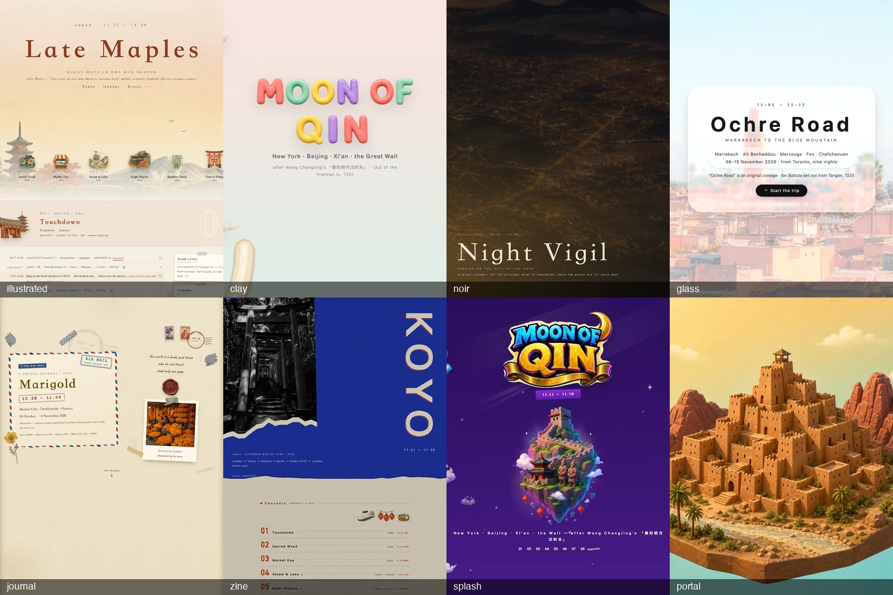
</p>


## What you get

Say *"Japan, 12–15 days in October, mid budget, history and food."* The skill returns:

- **A route across cities** with 2–3 skeletons to pick from, then real flight prices for a
  grid of dates and a train-vs-fly call for every intercity leg.
- **An hour-level plan for every day** — opening hours and closure days checked against
  tools, dwell times and buffers from a written scheduling method, a holiday and festival
  collision scan, and a tappable map link on every hop.
- **`plan.geo.json`**, the single source of truth, rendered to a **plain self-contained HTML**
  (offline, printable, phone-friendly) and an **offline KML** for Google Earth / Organic Maps.
- **A hotel shortlist by neighbourhood** (dated deep links, not invented nightly rates), a
  budget rollup in your home currency, and a **booking checklist sorted by deadline**.
- Optionally, the same plan through **eight themed renderers** — illustrated, clay, noir,
  glass, journal, zine, splash, portal — each a self-contained page with offline
  **share-image buttons** (save this day / save the appendix / one long image; whole-page
  export on six of the eight — noir and glass export day modules only).

It never books, pays, or enters personal data. You click the links.

> **中文摘要**:把"我要去某国玩 10-15 天"变成一份**可直接照着订**的行程 —— 跨城路线、机票比价、
> 逐小时日程、每一跳的地图链接、离线 KML、酒店片区、预算与按截止日排序的预订清单;核心是**核实**,
> 查不到的明确标 ⚠️;同一份 `plan.geo.json` 还可以渲染成八种主题版;从不代订、不付款、不填个人信息。
> 完整中文说明见 [README.zh-CN.md](README.zh-CN.md)。

## Quick start

**1. Install** — Claude Code discovers skills by directory, so clone straight into place:

```bash
git clone https://github.com/skywain/trip-planner-skill.git ~/.claude/skills/trip-planner
pip3 install --user fast-flights Pillow   # optional: flight price scanner · asset pipeline
```

Everything else is Python 3.9+ standard library. Without `fast-flights` the scanner
degrades to a Google Flights link; without Pillow you can still render every theme
from the shipped picture library. (The repository name may change before the first
public release; the clone URL above will be updated then.)

**Try it in 30 s** — no key, no Claude Code needed, from the repo root:

```bash
python3 scripts/render_plan.py examples/kyoto-sample.plan.geo.json -o kyoto.html          # the plain page
python3 themes/render_clay2.py examples/turkey-2026/turkey.geo.json -o turkey-clay.html \
  && python3 themes/qc.py turkey-clay.html                                                # a themed page + its QC (exit 0)
```

**2. Plan a trip** — in Claude Code, one sentence. The skill triggers on its own for
trip / flight / itinerary requests, or explicitly:

```
/trip-planner 10月从上海出发,日本12-15天,中等预算,历史+美食,日期可±3天,中国护照
/trip-planner Japan, 12-15 days in October from London, mid budget, history and food, dates ±3 days
```

The plan's UI language follows the language you ask in (`"lang": "zh"|"en"` in the plan;
`--lang` overrides on every renderer). Four modes are picked from what you ask:

| Mode | Trigger | What runs |
|---|---|---|
| **Full trip** | "plan me 12 days in Japan" | All phases: intake → country brief → route skeleton → flights → day plans → hotels → assemble + self-check |
| **Single day** | "we have one day in Rome" | Holiday/festival check + that day + self-check; flights and hotels skipped |
| **Gap filler** | "I'm near X with 2 free hours" | 2–3 options within a 15-min radius, each with walk time, map link, turn-back deadline |
| **Live replan** | "missed the train / it's pouring" | Rebuilds only the affected day from its degradation tags |

**3. Want the designed edition?** Three commands, from the repo root (full manual:
[`themes/README.md`](themes/README.md), [`references/themes.md`](references/themes.md)):

```bash
# optional: a <plan>.art.json beside the plan is picked up automatically — cover title, per-day titles, which pictures go where
python3 themes/render_<theme>.py plan.geo.json -o trip-<theme>.html   # theme2 clay2 noir2 glass2 journal zine splash portal
python3 themes/qc.py trip-<theme>.html                                # exit 0 = clean; exit code = FAIL count
themes/xprobe.sh trip-<theme>.html module '#d5' out.png              # click the real share button headlessly, look at out.png
```

The art contract is [`themes/ART-SCHEMA.md`](themes/ART-SCHEMA.md); every field is
optional and an empty art file must still render. Pictures resolve `--assets` → art dir →
plan dir → `themes/assets/`.

**4. Pictures and video: your own generator first, one key otherwise.** Reuse the shipped
library first — [`themes/assets/IMAGE-LIBRARY.md`](themes/assets/IMAGE-LIBRARY.md) indexes
301 stems (444 webp, 26 MB) by subject. For what is missing: **if the agent running the
skill can already generate images or video natively, it uses that — no key to set up**
(same specs and prompts, same `split_sheet.py` → `cutout.py` → `towebp.py` → trip-manifest
steps; the contract is in `themes/ART-SCHEMA.md` 「生成器选择」). Only an environment
without native generation needs the fallback scripts: create `themes/.auth_header` containing
one line — `Authorization: Bearer <your OpenRouter key>` — (gitignored, read only from
that directory; both scripts pass it to curl as a header file, so it must be the full
header line, not the bare key). `--dry-run` prints the credential path it would read:

```bash
python3 themes/gen.py <trip>/jobs.json --outdir <trip> --manifest <trip>/manifest.<trip>.json      # gpt-image-2; --dry-run first
python3 themes/genvideo.py jobs.json --outdir <trip>/portal --manifest <trip>/manifest.<trip>.json  # veo-3.1-lite by default; --models for prices
```

Real costs from the shipped examples: **$0.25–0.46 of image generation per trip** (7–11
`gpt-image-2` calls). Without a key you are limited to the library — which is enough for
every theme except anything destination-specific: covers, hero plates, title stickers,
terrain bands, splash islands, journal photos (the library rules in `IMAGE-LIBRARY.md`
forbid reusing those across trips). The **portal** theme is the
one that needs footage: either `genvideo.py` in the cloud (`google/veo-3.1-lite`, 720p,
≈ $0.03/s → roughly $3 for a ten-world chain; smoke-tested on one 4 s clip, $0.12) or a
local GPU (the author's regression footage comes from ComfyUI on an RTX 5090 via
`themes/build_portal_jobs.py`). The shipped chain in `themes/assets/portal/` (19 clips,
~35 MB) belongs to the US trip that drove the design; another trip needs its own.

## Showcase

Nine test trips, each planned end-to-end by a fresh agent using the skill, then rendered
through two themes each. Thumbnails are the rendered covers (`docs/showcase/`); seven trips
ship as reproducible examples under [`examples/`](examples/) (plan + art + KML + one
rendered HTML each).

| Trip · dates | Language | First theme | Second theme | Example |
|---|---|---|---|---|
| **Australia** — 北京 PEK → Sydney → Cairns → 北京 · 2026-10-01 → 10-08 | zh | journal 手账 ·「澳洲行」<br> | noir 夜航 ·「九万里风 / NINETY THOUSAND MILES OF WIND」<br> | — |
| **Nordic** — 北京 PEK → Oslo → Flåm / Nærøyfjord → Bergen → 北京 · 10-01 → 10-08 | zh | journal 手账 ·「秋水长天 / WHERE WATER MEETS SKY」<br> | noir 夜航 ·「天接云涛 / SEA OF CLOUDS」<br>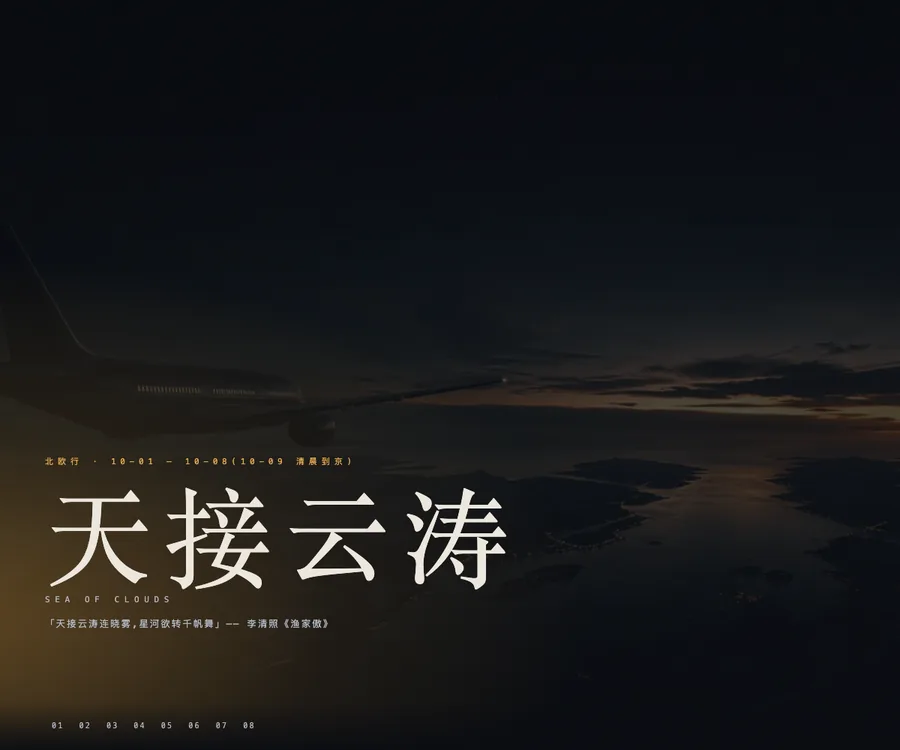 | [nordic-2026](examples/nordic-2026/) (noir) |
| **Japan** — London → Tokyo → Hakone → Kyoto → Osaka KIX → London (open-jaw) · 11-21 → 11-28 | en | zine · "KOYO"<br>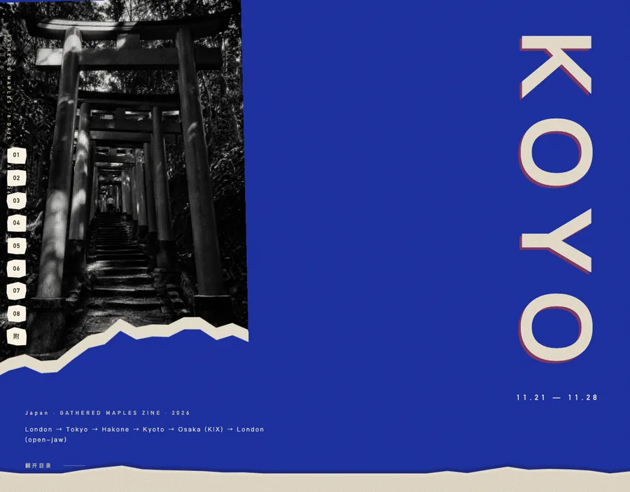 | illustrated 插画 · "Late Maples"<br>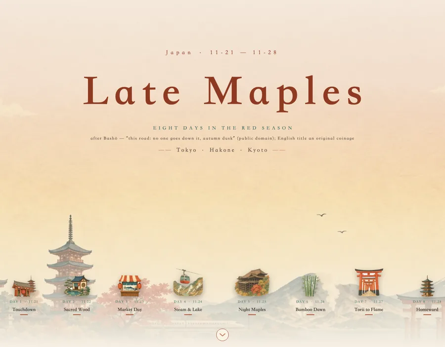 | [japan-2026](examples/japan-2026/) (illustrated) |
| **China** — New York → Beijing → Xi'an → Beijing → New York · 11-11 → 11-18 | en | clay 黏土 · "MOON OF QIN"<br>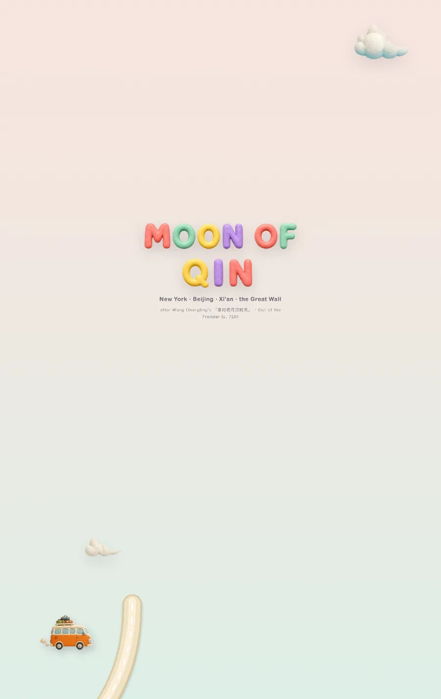 | splash 闪屏 · "MOON OF QIN"<br>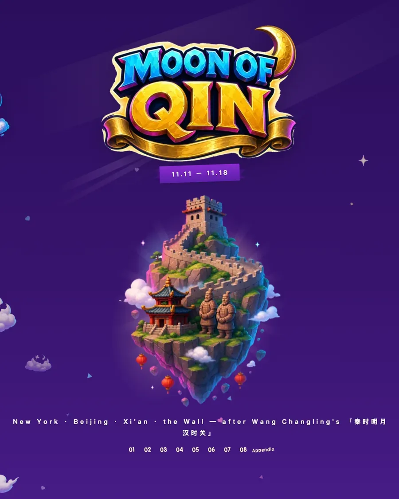 | [china-2026](examples/china-2026/) (splash) |
| **Italy** — Singapore → Rome → Florence → Venice → Singapore · 10-13 → 10-22 | zh | glass 玻璃 ·「千江月 / A Thousand River Moons」<br>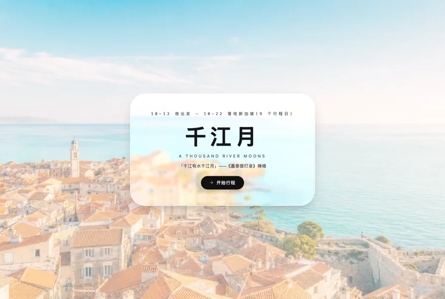 | portal 穿越 ·「天接云涛」— hold frame of the 3D Rome world; needs footage<br> | — |
| **Mexico** — Berlin → Mexico City → Oaxaca → Berlin · 10-28 → 11-06 (Día de Muertos) | en | journal · "Marigold"<br>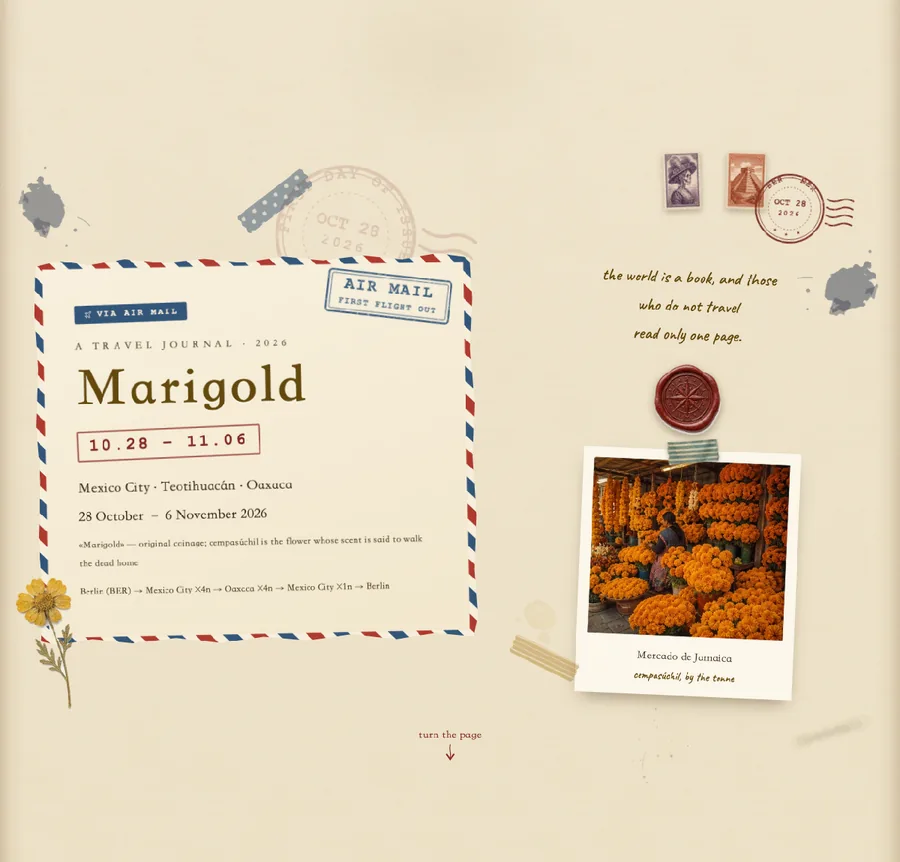 | noir · "Night Vigil / CANDLES ON THE HILL OF THE DEAD"<br> | [mexico-2026](examples/mexico-2026/) (journal) |
| **Morocco** — Toronto → Marrakech → Aït Benhaddou → Merzouga → Fes → Chefchaouen → Casablanca → Toronto · 11-06 → 11-15 | en | glass · "Ochre Road / MARRAKECH TO THE BLUE MOUNTAIN"<br>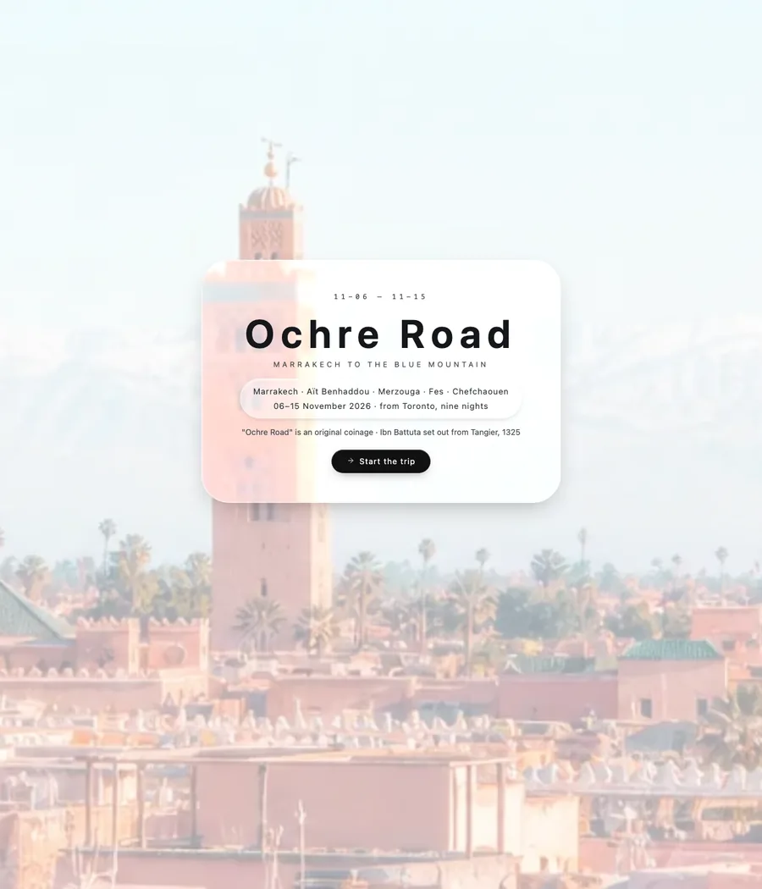 | portal · "Through Morocco" — hold frame; footage not shipped<br> | [morocco-2026](examples/morocco-2026/) (glass) |
| **Turkey** — Shanghai → Istanbul → Cappadocia → (night bus) → Pamukkale → Istanbul → Shanghai · 10-01 → 10-09 | zh | illustrated 插画 ·「天接云涛 / SEA OF CLOUDS AT DAYBREAK」<br>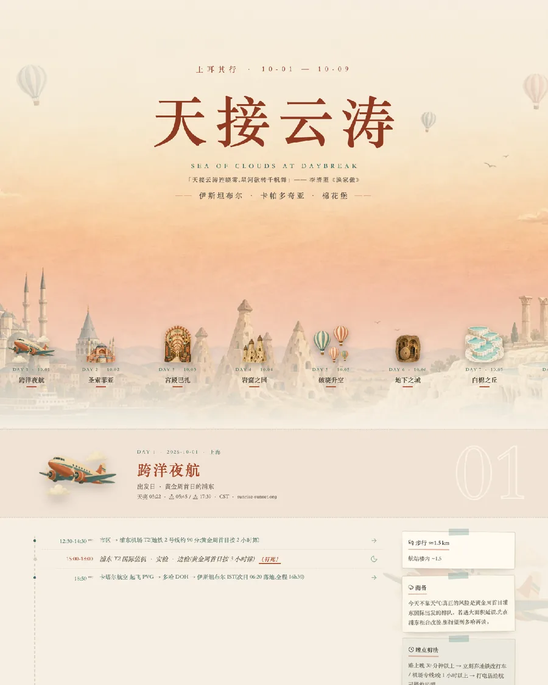 | clay 黏土 ·「九万里风」<br> | [turkey-2026](examples/turkey-2026/) (clay) |
| **Vietnam** — Shenzhen → Hanoi → Ha Long Bay → (night train) → Hoi An / Da Nang → Ho Chi Minh City → Shenzhen · 12-12 → 12-21 | zh | zine ·「人海 / A SEA OF FACES」<br>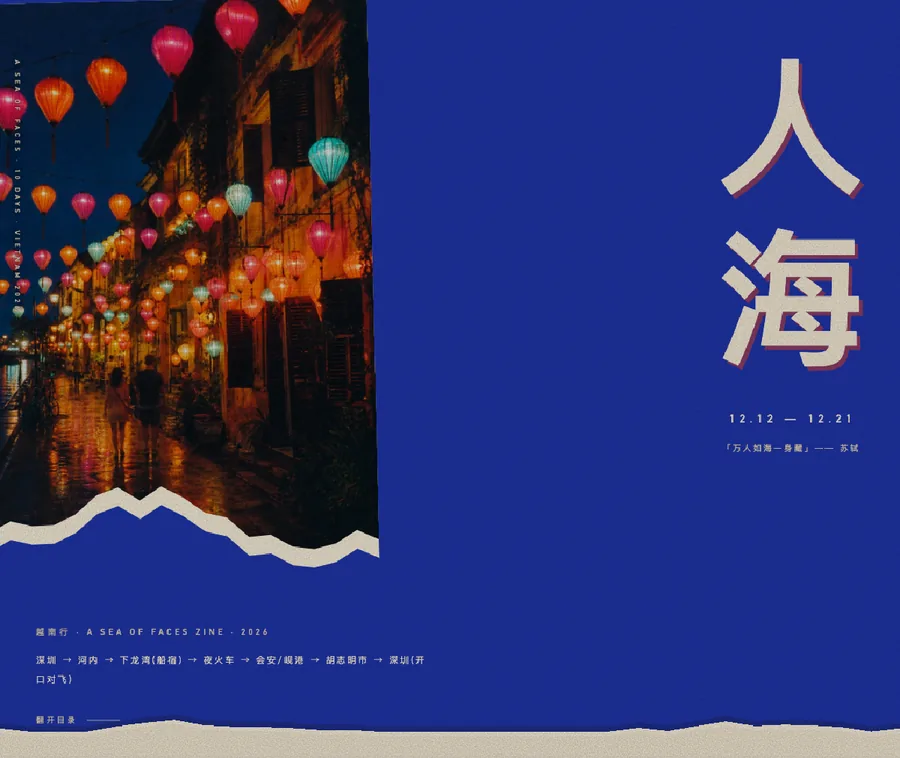 | splash 闪屏 ·「千江月 / A THOUSAND RIVER MOONS」<br>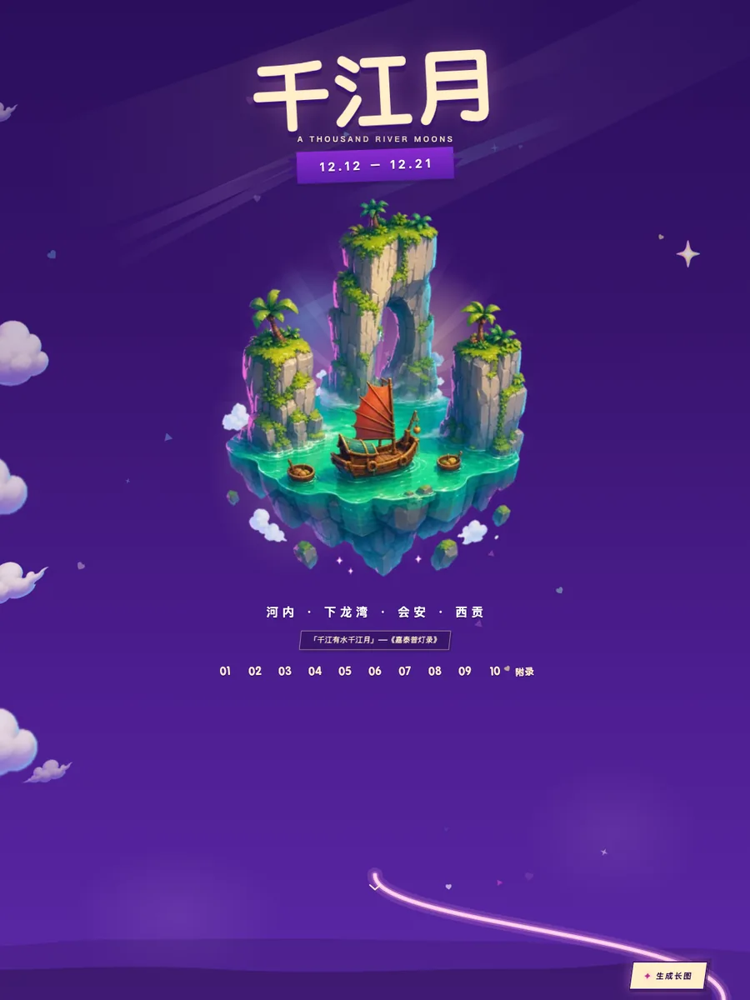 | [vietnam-2026](examples/vietnam-2026/) (zine) |

Inside pages — the day module is what the share buttons export:

| journal · Mexico day 03 (en) | clay · China day 3 (en) | splash · Vietnam day 3 (zh) |
|---|---|---|
| 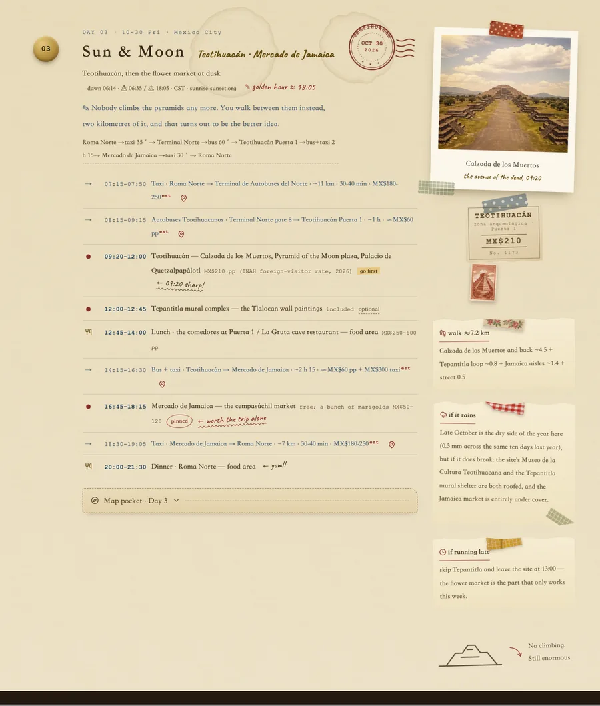 | 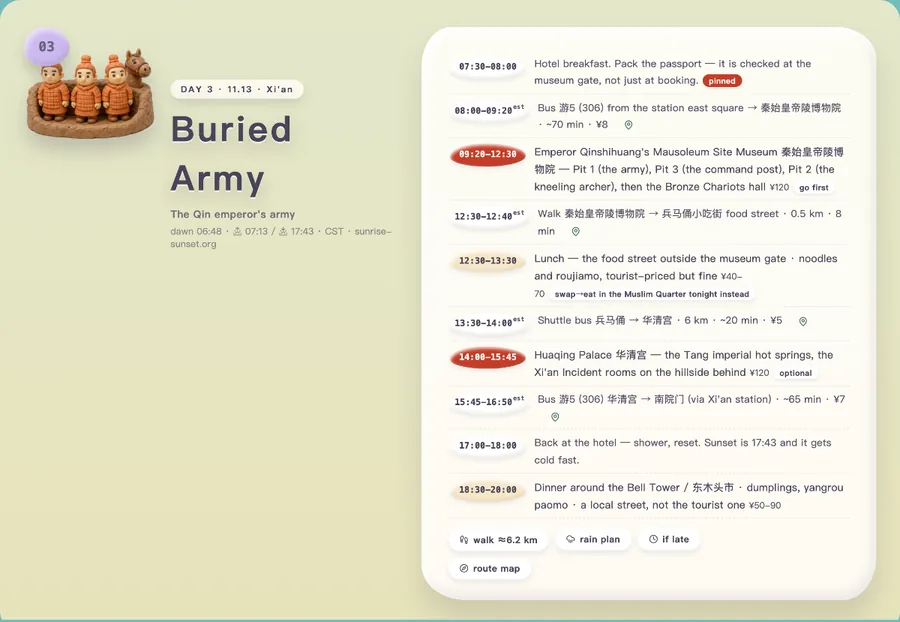 |  |

**Portal in motion** — the Morocco chain the page scrubs with scroll: dive into Marrakech →
frame-chained link → dive into Aït Benhaddou (three of the nine clips, 1.25× speed, no
HUD; the live page adds the day overlays and lets you scroll backwards to fly in
reverse). Rendered on a local GPU (MiniMax-H3, 21 min for five worlds); an agent with
native video generation, or `genvideo.py`, produces the same chain.

<p align="center">
  
</p>

The remaining inside pages (Australia journal day 04, Nordic noir, Japan zine, Italy
glass, Morocco portal intro, Turkey illustrated) are in [`docs/showcase/`](docs/showcase/).
The plain, un-themed page looks like [`examples/kyoto-sample.html`](examples/kyoto-sample.html).

### The eight themes

Each is a different design species, not a re-skin; all read the same `plan.geo.json`.

| theme | renderer | one line |
|---|---|---|
| **illustrated 插画** | `render_theme2.py` | a painted book on paper — serif, colour bands, pictures as background |
| **clay 黏土** | `render_clay2.py` | one continuous clay landscape with a road threading the milestone stones |
| **noir 夜航** | `render_noir2.py` | a single night-negative tracking shot; monospace body, dissolves between days |
| **glass 玻璃** | `render_glass2.py` | liquid-glass panes over a fixed world of cross-fading photographs |
| **journal 手账** | `render_journal.py` | a vintage travel journal on a dark desk — tape, stamps, postmarks, polaroids |
| **zine** | `render_zine.py` | torn riso-poster collage, giant vertical two-colour glyphs |
| **splash 闪屏** | `render_splash.py` | a game splash screen stretched into a scroll: floating islands, chained skies |
| **portal 穿越** | `render_portal.py` | scroll-scrubbed video fly-through — the one theme that needs footage |

`render_picker.py` builds a style-chooser page linking every rendered edition of a trip.

## How it works

**Pipeline.** `SKILL.md` is the playbook Claude Code follows: Phase 0 intake (one message,
only for what is missing) → Phase 1 country brief (visa from official sources, holiday API +
a budgeted festival search, weather, money, safety) → Phase 2 route skeletons → checkpoint
→ Phase 3 flights and intercity legs (`scripts/flight_scan.py`) → Phase 4 city day-plans
(parallel city subagents with an explicit search budget) → Phase 5 hotels → Phase 6
assemble, adversarial self-check, deliver. Two checkpoints with the user, no more.

**One file, one truth.** `plan.geo.json` is written once and read by everything:
`scripts/route_tools.py` (`geocode` · `check` · `links --write` · `kml` · `sun`) produces
the map links and the KML from its `stops`; `scripts/render_plan.py` produces the plain
HTML; every themed renderer reads the same file plus its `art.json`. That is what stops
the written plan, the map links and the pretty version from drifting apart. Schema
template: [`assets/plan.example.json`](assets/plan.example.json) — copy it, fill the
`PLACEHOLDER`s, then render (`render_plan.py` refuses an unfilled copy unless `--force`).

**Hard rules** (distilled from [`SKILL.md`](SKILL.md) and `references/`):

1. Never books, pays, holds, or enters personal data — links and a checklist only.
2. Prices and hours come from tools, never from memory; a missing price is "—, check link".
3. Cheap before expensive: bundled scripts and keyless APIs first, browser second; never
   curl OTA or airline sites.
4. Search budgets are explicit and written into every subagent prompt.
5. Estimates stay estimates: transit durations ship as `(est.)` ranges unless verified.
6. Beyond ~3 months out nobody publishes that day's hours — verify the seasonal pattern,
   stamp "as of {date}", put a re-confirm task on the checklist.
7. The plan must survive the self-check before delivery: closure scans, chain arithmetic,
   last-entry times, walking totals, open-jaw consistency.

**Data sources** — all keyless and free; prices are comparison-grade and the deep links
in the plan are the source of truth ([`references/data-sources.md`](references/data-sources.md)):

| Source | Used for | Notes |
|---|---|---|
| Google Flights (via `fast-flights`) | flight price grids | outbound legs listed; return times back-computed |
| Nominatim / OpenStreetMap | venue coordinates | 1 req/s + User-Agent enforced in-script; weak on non-Latin names |
| Nager.Date | public holidays | no religious / lunar holidays — a budgeted festival search covers the gap |
| Open-Meteo | weather and climate for the dates | first call can take ~10 s |
| sunrise-sunset.org | golden-hour scheduling | **requires visible attribution** in the plan footer |
| frankfurter.dev → open.er-api.com | FX | ECB daily, ~30 majors; minor / closed currencies fall back to open.er-api.com |
| Google Maps / Booking / operator sites | hotel bands, transit detail, tickets | browser, deep links only |

Hotels have no usable keyless API, so the skill recommends neighbourhoods and produces
dated deep links rather than quoting a nightly price it cannot verify.

## Repository layout

```
README.md  README.zh-CN.md    this page, English and Chinese
THIRD-PARTY-NOTICES.md        license texts for the redistributed font and icons (Caveat OFL, Lucide ISC)
SKILL.md                      the playbook: phases, hard rules, quick modes
references/
  data-sources.md             every API + URL recipe, with fallback chains
  scheduling.md               dwell times, buffers, day types, traps, verification list
  navigation.md               map links, hop-row format, verify-vs-estimate policy
  country-quick-notes.md      per-country passes, sell-outs, closure patterns (+ "destination not listed" checklist)
  output-template.md          the city-block hand-off + final deliverable structure
  cover-titles.md             bilingual poetic cover-title library + cliché blacklist
  themes.md                   themed-render manual: the eight themes, adding one, defect checklist
  art-schema.md               pointer to themes/ART-SCHEMA.md
scripts/
  flight_scan.py              Google Flights grid scanner (keyless, centre-out)
  route_tools.py              geocode → distance check → map links → KML → sun times
  render_plan.py              plan JSON → self-contained printable HTML
themes/
  README.md                   what is here, the three commands, where pictures come from
  render_theme2.py …          eight renderers: theme2 (illustrated) · clay2 · noir2 · glass2 · journal · zine · splash · portal
  render_picker.py            style-chooser page
  theme_common.py             shared helpers, i18n, the offline share-image engine
  qc.py  xprobe.sh  xt.sh     static QC · headless export probes
  gen.py  genvideo.py         fallback generators (OpenRouter gpt-image-2 / video, one key) for agents without native generation
  towebp.py cutout.py split_sheet.py build_manifest.py build_portal_jobs.py
                              asset pipeline (png→webp, cut-outs, sheet splitting, manifest, portal jobs)
  ART-SCHEMA.md               the art.json contract (the only copy)
  assets/                     picture library: 444 webp (301 stems), Caveat font, manifest.json,
                              IMAGE-LIBRARY.md (index by subject), portal/*.mp4 (19 clips)
assets/plan.example.json      schema template — copy it, fill the PLACEHOLDERs, then render (or --force to preview)
examples/                     seven themed trips (plan + art + KML + rendered HTML + README) and the plain Kyoto sample
docs/
  showcase/                   README images (covers, day modules, hero grid)
  verification.md             how the skill was hardened, and what the reviews caught
  KNOWN-ISSUES.md             26 live defects and hard limits, each with a source pointer, plus the roadmap
```

Not in the repo: personal trip data (`trips/`), PNG originals, and the OpenRouter
credential file `themes/.auth_header` that `gen.py` / `genvideo.py` read.

## Verification

- **Static QC** — `themes/qc.py page.html` checks the offline contract (no network, no
  external fetches), no-JS survival, print, focus order and link hygiene; exit code is the
  FAIL count. The seven themed examples re-render byte-identically from their README
  commands and pass; the plain `render_plan.py` page (`examples/kyoto-sample.html`)
  passes too.
- **Export probes** — `themes/xprobe.sh` / `xt.sh` drive a headless Chrome to click
  the page's real share button and write the image it produces, so export defects are
  seen, not assumed. macOS with Google Chrome in `/Applications` only (the path is
  hardcoded in the probes). Run them serially.
- **Friction testing** — the most valuable technique: give a fresh agent that has never
  seen the skill a real trip request, let it follow the instructions in order, and treat
  every place it got confused as the primary deliverable. The nine trips above were
  planned this way (each by a fresh agent session that had never seen the skill), on top of the earlier Kyoto and
  Rome runs; the friction points became rules in `references/` and entries in
  `country-quick-notes.md`.
- **Adversarial review** — three rounds by seven independent agents (script torture-tester,
  external fact-checker, tour-leader realism attacker, cross-file coherence reviewer, two
  end-to-end builders). What they caught, and the rules that came out of it:
  [`docs/verification.md`](docs/verification.md).

## Status and known issues

Working, personal-use software under active development. Every defect and hard limit
that is live in the current tree is listed in [`docs/KNOWN-ISSUES.md`](docs/KNOWN-ISSUES.md)
— 26 entries across export/renderers, planning scripts, assets and scope, each with a
symptom, workaround and source pointer, plus a short roadmap (whole-page export sizing,
journal `zh` cover fix, picker copy, a portrait portal chain, a post-trip photo album,
affiliate rails, and a name).

**Requirements.** Python 3.9+ (macOS system Python is fine); standard library only,
except optional `fast-flights` (flight scanner) and Pillow (asset pipeline: `towebp.py`,
`cutout.py`, `split_sheet.py`, `gen.py`). `gen.py` / `genvideo.py` need `themes/.auth_header`
(one line: `Authorization: Bearer <OpenRouter key>`) — and only when the agent has no native
image/video generation of its own. The export probes need macOS with
Google Chrome in `/Applications` (path hardcoded). Rendering any theme from the
shipped library needs none of these.

**Limitations and non-goals.**

- **Personal-use posture.** The browser and scraping steps are what one traveller would do
  by hand. A hosted service for others would need affiliate rails (Travelpayouts, an
  Amadeus production key, Viator/GetYourGuide APIs) — the free sources here are not
  licensed for redistribution.
- **Not real-time.** It plans; it does not track delays or rebook.
- **Prices move.** Every figure carries an as-of date for exactly that reason.
- **Portal needs footage** you generate or render yourself; the shipped chain is one trip's.

## Contributing

Issues and pull requests are welcome. The three most useful contributions:

- **A new country** — add a section to
  [`references/country-quick-notes.md`](references/country-quick-notes.md) following the
  "Destination not listed?" checklist at the top of that file (passes, sell-outs, closure
  patterns, holiday feed gaps), ideally after planning a real trip there with the skill.
- **A new theme** — read [`references/themes.md`](references/themes.md) §4 (adding a theme)
  and §5 (the recurring-defect checklist, every item on every new theme); the art contract
  is `themes/ART-SCHEMA.md`, and shared helpers live in `themes/theme_common.py`.
- **A friction report** — plan a trip with the skill as a first-time user and file every
  place the instructions fought you. That is how most of the current rules were found.

Before opening a PR: `python3 themes/qc.py` on any themed page you rendered (exit 0), one
`xprobe.sh` export looked at with your own eyes, and re-render one of the `examples/`
trips to confirm it is still byte-identical.

## Credits

- [Caveat](https://fonts.google.com/specimen/Caveat) (SIL Open Font License 1.1) — the handwriting
  webfont embedded in the journal theme (`themes/assets/caveat-vf.woff2`).
- [Lucide](https://lucide.dev/) (ISC) — the icon sprite in `themes/lucide-icons.json`.
  License texts for both: [`THIRD-PARTY-NOTICES.md`](THIRD-PARTY-NOTICES.md).
- [OpenStreetMap](https://www.openstreetmap.org/copyright) contributors and
  [Nominatim](https://operations.osmfoundation.org/policies/nominatim/) — geocoding, under
  its usage policy (1 req/s, identifying User-Agent).
- [sunrise-sunset.org](https://sunrise-sunset.org/) — sun times; attribution is required
  wherever the data is shown, and the rendered plan pages print it in the footer.
- [Nager.Date](https://date.nager.at/), [Open-Meteo](https://open-meteo.com/),
  [frankfurter.dev](https://frankfurter.dev/), [open.er-api.com](https://www.exchangerate-api.com/)
  — holidays, weather, FX.
- Generated pictures: `openai/gpt-image-2` via [OpenRouter](https://openrouter.ai/).
  The shipped portal clips (`themes/assets/portal/`, 19 mp4) were rendered locally with
  MiniMax-H3 in ComfyUI; the cloud alternative in `genvideo.py` is `google/veo-3.1-lite`
  (default) or `minimax/hailuo-3` via OpenRouter.

## License

MIT — see [LICENSE](LICENSE). © 2026 skywain.
